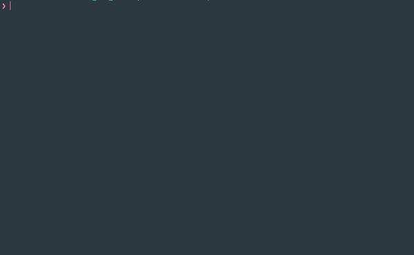

# s21_matrix+

Реализация библиотеки s21_matrix_oop.h

## Содержание

1. [Вступление](#вступление)
2. [Сборка библиотеки](#сборка-библиотеки)
3. [Матричные операции](#операции-над-матрицами)
4. [Техническое задание](#техническое-задание)
5. [Модульные тесты](#модульные-тесты)

## Вступление

Этот проект был выполнен в соответствии с учебной программой [Школы 21](https://21-school.ru).  

В рамках данного проекта я ознакомился с синтаксисом и особенностями языка C++. Я практиковал применение объектно-ориентированного подхода (ООП) и изучал правило пяти, семантику перемещения и ссылки. Я сохранял подход, заключающийся в выделении всей памяти за один раз для всей матрицы, как и в предыдущем проекте. Кроме того, все функции были тщательно протестированы с использованием [Google Test Framework](https://google.github.io/googletest/).

## Сборка библиотеки

Пожалуйста, откройте директорию `./src` и выполните команду `make` в терминале, чтобы собрать библиотеку **s21_matrix_oop.a**.

### Операции над матрицами

| Операция    | Описание   | Исключительные ситуации |
| ----------- | ----------- | ----------- |
| `bool EqMatrix(const S21Matrix& other)` | Проверяет матрицы на равенство между собой |  |
| `void SumMatrix(const S21Matrix& other)` | Прибавляет вторую матрицы к текущей | различная размерность матриц |
| `void SubMatrix(const S21Matrix& other)` | Вычитает из текущей матрицы другую | различная размерность матриц |
| `void MulNumber(const double num)` | Умножает текущую матрицу на число |  |
| `void MulMatrix(const S21Matrix& other)` | Умножает текущую матрицу на вторую | число столбцов первой матрицы не равно числу строк второй матрицы |
| `S21Matrix Transpose()` | Создает новую транспонированную матрицу из текущей и возвращает ее |  |
| `S21Matrix CalcComplements()` | Вычисляет матрицу алгебраических дополнений текущей матрицы и возвращает ее | матрица не является квадратной |
| `double Determinant()` | Вычисляет и возвращает определитель текущей матрицы | матрица не является квадратной |
| `S21Matrix InverseMatrix()` | Вычисляет и возвращает обратную матрицу | определитель матрицы равен 0 |

Помимо реализации данных операций, необходимо также реализовать конструкторы и деструкторы:

| Метод    | Описание   |
| ----------- | ----------- |
| `S21Matrix()` | Базовый конструктор, инициализирующий матрицу некоторой заранее заданной размерностью |  
| `S21Matrix(int rows, int cols)` | Параметризированный конструктор с количеством строк и столбцов | 
| `S21Matrix(const S21Matrix& other)` | Конструктор копирования |
| `S21Matrix(S21Matrix&& other)` | Конструктор переноса |
| `~S21Matrix()` | Деструктор |

А также нужно перегрузить следующие операторы, частично соответствующие операциям выше:

| Оператор    | Описание   | Исключительные ситуации |
| ----------- | ----------- | ----------- |
| `+`      | Сложение двух матриц  | различная размерность матриц |
| `-`   | Вычитание одной матрицы из другой | различная размерность матриц |
| `*`  | Умножение матриц и умножение матрицы на число | число столбцов первой матрицы не равно числу строк второй матрицы |
| `==`  | Проверка на равенство матриц (`EqMatrix`) | |
| `=`  | Присвоение матрице значений другой матрицы | |
| `+=`  | Присвоение сложения (`SumMatrix`)   | различная размерность матриц |
| `-=`  | Присвоение разности (`SubMatrix`) | различная размерность матриц |
| `*=`  | Присвоение умножения (`MulMatrix`/`MulNumber`) | число столбцов первой матрицы не равно числу строк второй матрицы |
| `(int i, int j)`  | Индексация по элементам матрицы (строка, колонка) | индекс за пределами матрицы |

## Техническое задание

- Программа должна быть разработана на языке C++ стандарта C++17 с использованием компилятора gcc
- Код программы должен находиться в папке src
- При написании кода необходимо придерживаться Google Style
- Реализовать матрицу в виде класса `S21Matrix`
- Хранить только приватные поля `matrix_`, `rows_` и `cols_`
- Реализовать доступ к приватным полям `rows_` и `cols_` через accessor и mutator. При увеличении размера - матрица дополняется нулевыми элементами, при уменьшении - лишнее просто отбрасывается
- Оформить решение как статическую библиотеку (с заголовочным файлом s21_matrix_oop.h)
- Реализовать операции, описанные [выше](#операции-над-матрицами)
- Перегрузить операторы в соответствии с таблицой в разделе [выше](#операции-над-матрицами).
- Подготовить полное покрытие unit-тестами функций библиотеки c помощью библиотеки GTest
- Предусмотреть Makefile для сборки библиотеки и тестов (с целями all, clean, test, s21_matrix_oop.a)

## Модульные тесты

С использованием Google Test Framework были написаны тесты для всех функций, включая обработку ошибок. Это обеспечивает полное покрытие кода тестами и гарантирует правильное поведение программы, включая корректную обработку ошибок. Отличная работа в применении такого подхода!

